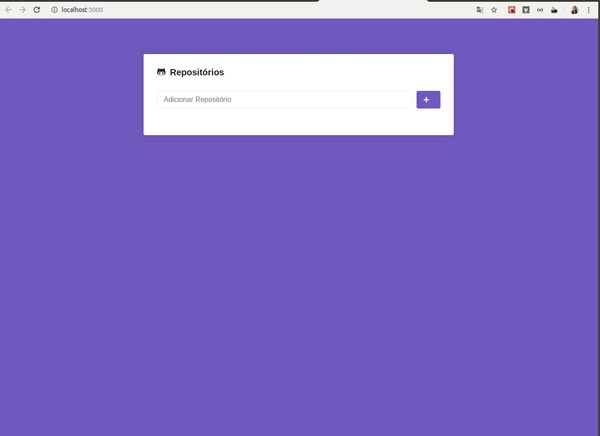

# GitRepo-ReactJs
  Aplicação ReactJs que consome dados da  <a href="https://developer.github.com/v3/" target="_blank">API do GitHub</a> 
  e que permite adicionar usuários do GitHub  e listar os repositórios favoritos dos mesmos.
  Aplicação desenvolvida no <a href="https://rocketseat.com.br/bootcamp" target="_blank"> Rockeseat GoStack Bootcamp</a>
  
  

# Tecnologias Utilizadas :

* React
* Axios
* prop-types
* styled-components
* ESLint

# Instalação


**- Se estiver utilizando Yarn**
```
  Todos os comandos abaixo devem ser excutados na raiz do Projeto 
  Para instalar as dependências:
  yarn install   
  
  Para startar a aplicação :
  yarn start 
  
  Executa o aplicativo no modo de desenvolvimento.
  Abra http: // localhost: 3000 para visualizá-lo no navegador. 
   
```

**- Se estiver utilizando npm**
```
  Todos os comandos abaixo devem ser excutados na raiz do Projeto 
  Para instalar as dependências:
  npm install   
  
  Para startar a aplicação :
  npm start 
  
  Executa o aplicativo no modo de desenvolvimento.
  Abra http: // localhost: 3000 para visualizá-lo no navegador. 

```

## Licença

This project is licensed under the MIT License - see the [LICENSE.md](LICENSE.md) file for details

